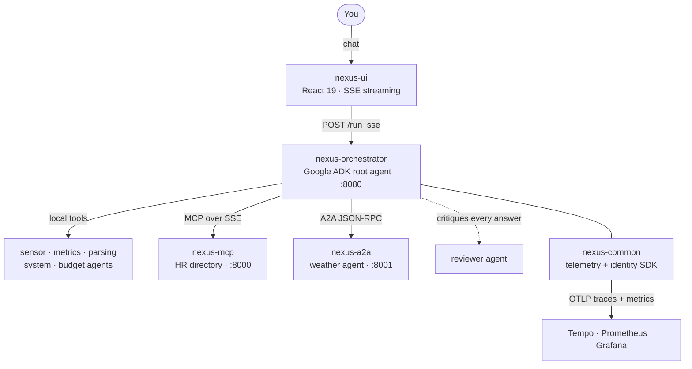
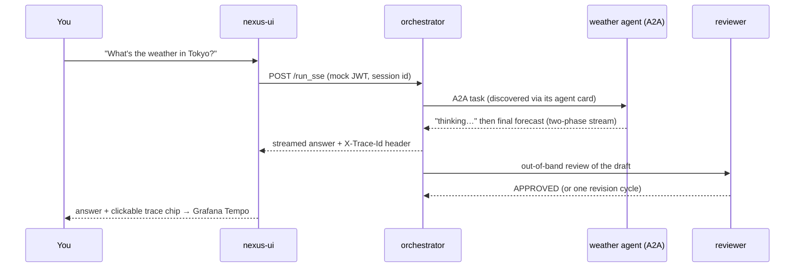

<p align="center">
  
</p>

<h1 align="center">Nexus — a Multi-Agent Communication Learning Lab</h1>

<p align="center">
  <em>Watch AI agents discover each other, delegate work, review each other's answers,<br/>
  and leave a distributed trace of every conversation.</em>
</p>

---

Nexus is an **educational platform for learning how AI agents communicate**. It is a small but genuinely distributed system: a root "orchestrator" agent receives your chat message, decides which specialist should handle it, and delegates over real, open protocols — **A2A** (Agent-to-Agent, JSON-RPC) and **MCP** (Model Context Protocol). Every hop is observable: each answer in the chat UI carries a link to its full distributed trace.

This is a learning lab, not a product. Every design decision favors clarity over cleverness, the code is deliberately over-commented (a Semgrep rule *enforces* that every source file contains an `# EDUCATIONAL NOTE:`), and the failure modes we hit while building it are documented rather than hidden — see [Lessons this lab teaches](#lessons-this-lab-teaches-the-hard-way).

## The system at a glance



A conversation turn, end to end:



## What you'll learn here

| Concept | Where it lives | The short version |
|---|---|---|
| **Agent cards & dynamic discovery** | `nexus-a2a/server.py`, `orchestrator/agents/dynamic_agents.py` | A2A agents publish `/.well-known/agent-card.json`; the orchestrator fetches every URL in `A2A_AGENT_URLS` at startup and registers one agent per card — *named and described by the card itself*. Add an agent by publishing a card, not by editing the router. |
| **LLM routing** | `orchestrator/app.py`, `eval_cases.py` | The root agent picks a specialist from the descriptions in its agent tree. Routing quality is a function of how well each agent describes itself — and it's measured by an eval suite, not vibes. |
| **Sticky delegation & peer transfer** | `orchestrator/agents/AGENTS.md` | After a hand-off, the *sub-agent* owns the conversation and can transfer directly to a peer. The root only routes turn one. (Strict hub-and-spoke is one flag away: `disallow_transfer_to_peers`.) |
| **Reviewer / critic pattern** | `orchestrator/reviewer.py` | Every answer is critiqued before you see it — in an isolated session so QA scaffolding never pollutes chat history. A rejected draft gets exactly one revision cycle. Toggle with `REVIEWER_ENFORCEMENT`. |
| **MCP tools & identity** | `nexus-mcp/server.py` | Tools are plain typed Python functions; FastMCP generates the schemas. A mock JWT propagates through every hop, and `delete_user` demonstrates authorization + human-in-the-loop approval. |
| **Two-phase A2A streaming** | `nexus-a2a/server.py` | Remote agents stream a "thinking" event before the result, so the UI always has something to show. |
| **Generative UI** | `nexus-ui/src/components/` | Answers carrying structured `data.type` render bespoke widgets (weather cards), not markdown blobs. |
| **Distributed tracing** | `nexus-common/`, `nexus-ui/src/lib/trace.ts` | W3C trace context flows browser → orchestrator → sub-agents → back. Every chat answer links to its Tempo trace. |
| **Pluggable persistence** | `orchestrator/persistence/` | Sessions and memory in-memory, Redis (default in the stack), or Postgres + pgvector RAG — behind one interface. |

## Quickstart

**Prerequisites:** Docker (compose v2), Node.js + npm (the UI builds on the host), [uv](https://docs.astral.sh/uv/) (Python tooling), and a Gemini API key ([aistudio.google.com](https://aistudio.google.com/)).

```bash
cd nexus-stack
cp .env.example .env        # then edit .env: set GEMINI_API_KEY=<your key>
make doctor                 # preflight — tells you exactly what's missing
make up                     # infra (Postgres/Redis/Grafana/Tempo/Prometheus/OTel) + app services
make demo                   # guided 3-prompt conversation with trace links
```

Then open:

| Where | What |
|---|---|
| http://localhost:5173 | Chat UI — service health grid, delegation notices, trace chips |
| http://localhost:3000 | Grafana — Tempo traces + Prometheus dashboards (login `admin` / `admin`) |
| http://localhost:8080/health | Orchestrator API |

> **Ports taken on your machine?** 8080 and 5173 are popular. Set `ORCHESTRATOR_HOST_PORT` / `FRONTEND_HOST_PORT` in `.env` — the demo script follows automatically; rebuild the UI with a matching `VITE_API_BASE_URL` for browser use. This matters because a squatted port makes the VM port-forward **fail silently** while container healthchecks stay green.

### A guided tour (10 minutes)

1. **MCP delegation** — ask: *"Who works in the engineering department?"* Watch the "Delegating to mcp_agent" notice, then click the trace chip on the answer and follow the request through orchestrator → MCP server in Tempo.
2. **A2A delegation** — ask: *"What's the weather in Tokyo?"* Two-phase streaming: "thinking…" then the forecast, rendered as a weather widget.
3. **Defensive agents** — ask: *"What's the weather like?"* (no location). The weather agent refuses to guess and asks for a city. It once confidently reported the weather for "the engineering department" — see [lessons](#lessons-this-lab-teaches-the-hard-way).
4. **Human-in-the-loop** — ask it to delete a user from the HR directory and an Approve button appears; nothing happens without your click.
5. **The critic at work** — every answer you received was already reviewed. Set `REVIEWER_ENFORCEMENT=false` in `.env` and restart to feel the difference.
6. **Local tools** — ask: *"Get the latest reading from sensor SENSOR_789."*

## Repository map

One git repository, independently deployable services. **Every directory contains an `AGENTS.md`** describing the files at that level — written so an AI agent (or a human) landing anywhere can orient without reading the whole tree. Start with the root [`AGENTS.md`](AGENTS.md); the `.kiro/steering/` docs hold the system-wide rules.

| Directory | What it is |
|---|---|
| [`nexus-orchestrator/`](nexus-orchestrator/) | The root agent: Google ADK + FastAPI/SSE, routing, reviewer enforcement, persistence backends, CLI (`chat`, `serve`, `evals`) |
| [`nexus-mcp/`](nexus-mcp/) | HR directory MCP server: FastMCP over SSE, SQLite/SQLModel, alembic, admin-gated `delete_user` |
| [`nexus-a2a/`](nexus-a2a/) | Weather sub-agent speaking the A2A protocol: agent card, two-phase streaming, wttr.in with input validation |
| [`nexus-ui/`](nexus-ui/) | React 19 + Vite chat dashboard: SSE parsing, generative UI, HITL approvals, per-message trace links |
| [`nexus-common/`](nexus-common/) | Shared Python SDK: one-call telemetry bootstrap (OTel + Prometheus) and mock-JWT identity, `py.typed` |
| [`nexus-stack/`](nexus-stack/) | Deployment hub: compose file, the Makefile (the interface for everything), `.env.example`, Semgrep standards, service scaffold |
| [`nexus-dev-infra/`](nexus-dev-infra/) | Observability + data infra compose: Postgres, Redis, Tempo, Prometheus, Grafana (pre-provisioned dashboards) |
| [`nexus-integration/`](nexus-integration/) | Live-stack tests, including true end-to-end routing assertions against the real LLM |
| [`.github/workflows/`](.github/workflows/) | Path-filtered CI: per-service lint/type/test, Semgrep, Checkov |

## Everyday commands

All from `nexus-stack/`:

```bash
make doctor        # preflight checks with fix suggestions
make up / down     # start / stop everything
make demo          # scripted guided conversation with trace links
make chat          # interactive CLI chat (same brain, no browser)
make test          # unit tests for every service + live integration suite
make lint          # ruff (all Python) + eslint (UI)
make type-check    # mypy + tsc
make evals         # LLM routing evals (real Gemini calls)
make verify-all    # lint + types + evals + Semgrep standards + Checkov
make clean         # remove Nexus-built images + build cache (never data)
make clean-all FORCE=1   # ...and delete the data volumes (gated on purpose)
```

Python development uses a **uv workspace**: one `uv sync` at the repo root materializes a single `.venv` for all four Python projects (`uv run --project nexus-orchestrator pytest nexus-orchestrator/tests/`). The per-service `requirements.txt` files are hand-kept mirrors consumed by Docker and CI — change dependencies in `pyproject.toml` *and* the mirror.

### Testing tiers

| Tier | Command | Needs |
|---|---|---|
| Unit (every service, all I/O mocked) | `make test` (first half) | nothing |
| Integration (live containers: discovery, persistence, **real LLM routing**) | `make test` (second half) | stack up + API key |
| Browser E2E (Playwright) | `make test-e2e` | stack up |
| Routing evals (LLM-as-judge) | `make evals` | stack up + API key |

CI runs the unit tier plus Semgrep/Checkov, path-filtered per service; stack-dependent tiers are deliberately local-only.

## Add your own agent

```bash
cd nexus-stack
make new-agent NAME=jokes        # scaffolds ../nexus-jokes on the next free port
```

The scaffold is a complete A2A service — agent card, two-phase streaming executor, health/telemetry/identity wiring, passing tests — with a `TODO` where your capability goes. The printed checklist wires it in (compose entry, Prometheus target, uv workspace member), and then the punchline: **append its URL to `A2A_AGENT_URLS` and restart** — the orchestrator fetches the card and your agent joins the routing table under whatever name its card declares. No router edits.

## Lessons this lab teaches (the hard way)

These all actually happened here, are fixed, and are preserved in code comments and tests because they generalize (the full story, from monolith to publication, is told in [docs/JOURNEY.md](docs/JOURNEY.md)):

- **Delegated input contains someone else's conversation.** ADK splices prior context into A2A requests. The weather agent once extracted "the engineering department" as a city — and wttr.in cheerfully geocoded it. Sub-agents must validate inputs and refuse to guess; ours now does, and the scaffold template inherits the defense.
- **Streaming + review is an ordering problem.** Clients treat the last non-partial event as *the* answer, so a naive reviewer that appends its verdict replaces the answer with the critique. Review must run out-of-band, in an isolated session, and write back only clean results.
- **The router only routes turn one.** Conversations stick to the last active agent, which may hand off peer-to-peer. Know your framework's transfer semantics before reasoning about "central" control.
- **Container-only dependency drift is invisible to unit tests.** A transitive dependency your lockfile happens to satisfy locally (`sqlalchemy` via an old `google-adk`) breaks only in a fresh container build. Declare what you import; pin what has broken before (`a2a-sdk==0.3.25`).
- **Virtualized ARM lies about CPU features.** The `cryptography` wheel SIGILLs on colima/QEMU vCPUs that advertise crypto instructions they can't execute — hence `OPENSSL_armcap=0` in the compose file.
- **A squatted host port fails silently.** In-container healthchecks stay green while the VM port-forward loses to whatever already listens on 8080. Hence overridable host ports and a `make doctor`.
- **Case-sensitivity plus an LLM equals nondeterminism.** Models pass `"engineering"` or `"Engineering"` on different runs; exact-match lookups turn that into answers that flap. Tool inputs get normalized.

## For AI agents working on this repo

This project practices what it demonstrates: it is documented *for* agents. Every directory's `AGENTS.md` states the purpose, business rules, and hazards of the files at that level; `.kiro/steering/` holds the system-wide conventions (`product.md`, `structure.md`, `tech.md`); `nexus-stack/.env.example` is the canonical environment-variable reference. Cross-service contracts (compose service names, the Tempo datasource uid, agent-card names) are called out where they live. Keep the docs in sync with the code — a Semgrep-enforced educational comment and an accurate AGENTS.md are part of the definition of done here.
