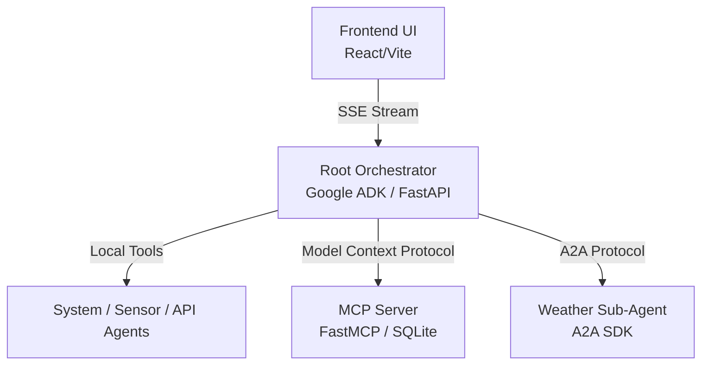

# Multi-Agent & MCP Learning Lab

This project is a hands-on educational resource for building modular, containerized, agentic systems using the **Google Agent Development Kit (ADK)**, the **Model Context Protocol (MCP)**, and the **Agent-to-Agent (A2A) Protocol**.

## 🏗️ Architecture

The lab is structured as a distributed microservices architecture, orchestrated via Docker Compose.



### Components (`projects/`)
*   **`orchestrator`**: The central intelligence. Runs a FastAPI web server using `AdkWebServer`. It routes incoming user requests to the appropriate sub-agent based on context and history.
*   **`mcp_server`**: A standalone tool server. Demonstrates how to expose a local, private SQLite database (HR Directory) to the LLM without giving the LLM direct code execution or network access.
*   **`a2a_agent`**: A standalone sub-agent. Demonstrates how to build an independent agent service (Weather Forecaster) that the orchestrator can "hire" over an HTTP network using a standardized JSON-RPC protocol.
*   **`frontend`**: A modern, real-time React UI that connects to the orchestrator via Server-Sent Events (SSE), parsing streaming deltas to build the chat interface.

---

## 🚀 Getting Started

### Prerequisites
*   Docker & Docker Compose
*   A Gemini API Key (get one at [aistudio.google.com](https://aistudio.google.com/))

### 1. Setup Environment
Add your API key to the root `.env` file:
```env
GEMINI_API_KEY=your_key_here
```

### 2. Run the Stack (using Make)
We provide a `Makefile` to simplify Docker commands.

```bash
# Build and start all services in the background
make up
```

### 3. Use the App
1.  **Web UI**: Open [http://localhost:5173](http://localhost:5173) in your browser.
2.  **CLI Chat**: If you prefer the terminal:
    ```bash
    make chat
    ```

### 4. Stop the Stack
```bash
make down
```

---

## 🎓 Learning Objectives

This repository is heavily commented with `HOW` and `WHY` tags. Start exploring here:

1.  **Orchestrator Setup**: Read `projects/orchestrator/server.py` to learn how to wrap an ADK agent in a FastAPI web server with InMemory state management.
2.  **Routing Logic**: Read `projects/orchestrator/main.py` to see how the `root_agent` is instructed to delegate tasks.
3.  **MCP Integration**: Read `projects/mcp_server/server.py` to see how `@mcp.tool()` automatically generates JSON schemas from Python functions.
4.  **A2A Protocol**: Read `projects/a2a_agent/server.py` to understand how the `AgentCard` facilitates dynamic capability discovery.
5.  **Streaming UIs**: Read `projects/frontend/src/App.tsx` (specifically the `fetch` loop) to learn how to parse LLM SSE streams and handle progressive text updates without duplication.
6.  **Foundation Model Abstraction**: Check out `projects/orchestrator/adapters/bedrock_adapter.py` and `ollama_adapter.py` to learn how the ADK allows you to swap out Gemini for other models (like Claude on Bedrock or local OSS models via Ollama) without changing your orchestration logic.

---

## 🏠 Running Locally with Ollama

You can run this lab entirely locally using [Ollama](https://ollama.com/).

1.  **Install Ollama** and pull a model:
    ```bash
    ollama pull llama3
    ```
2.  **Start the services** (the orchestrator will detect the adapter):
    ```bash
    make up
    ```
3.  **Switch the model** in the frontend or by setting the `AGENT_MODEL` environment variable to `ollama/llama3`.

---

## 🧪 Testing

The orchestrator includes a suite of integration tests, including an "LLM-as-a-judge" pattern.

```bash
# Run backend tests
make test
```