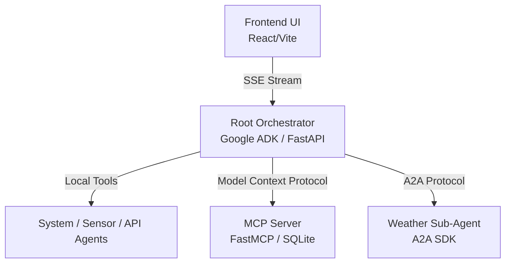

# Multi-Agent & MCP Learning Lab

This project is a hands-on educational resource for building modular, containerized, agentic systems using the **Google Agent Development Kit (ADK)**, the **Model Context Protocol (MCP)**, and the **Agent-to-Agent (A2A) Protocol**.

## 🏗️ Architecture

The lab is structured as a distributed microservices architecture, orchestrated via Docker Compose.



### Components (sibling `nexus-*` directories)
*   **`nexus-orchestrator`**: The central intelligence. Runs a FastAPI web server using `AdkWebServer`. It routes incoming user requests to the appropriate sub-agent based on context and history.
*   **`nexus-mcp`**: A standalone tool server. Demonstrates how to expose a local, private SQLite database (HR Directory) to the LLM without giving the LLM direct code execution or network access.
*   **`nexus-a2a`**: A standalone sub-agent. Demonstrates how to build an independent agent service (Weather Forecaster) that the orchestrator can "hire" over an HTTP network using a standardized JSON-RPC protocol.
*   **`nexus-ui`**: A modern, real-time React UI that connects to the orchestrator via Server-Sent Events (SSE), parsing streaming deltas to build the chat interface.

---

## 🚀 Getting Started

### Prerequisites
*   Docker & Docker Compose
*   Node.js + npm (the UI is built on the host before its image is assembled)
*   A Gemini API Key (get one at [aistudio.google.com](https://aistudio.google.com/))

### 1. Setup Environment
Copy the documented template and add your API key:
```bash
cp .env.example .env
# then edit .env and set GEMINI_API_KEY=<your real key>
```
`.env.example` documents every variable the stack consumes; only `GEMINI_API_KEY` is required.

### 2. Preflight Check
```bash
make doctor
```
Verifies Docker (CLI + daemon), your `.env` / API key, the shared `nexus-net` network, Node/npm, and uv (the Python test/lint targets run through the workspace-root uv environment) — with a fix suggestion for anything missing.

### 3. Run the Stack (using Make)
```bash
# Build and start all services in the background
make up
```

### 4. Take the Guided Demo
```bash
make demo
```
Sends a short scripted conversation through the orchestrator — one prompt each for MCP delegation (HR directory), A2A delegation (weather agent), and a local tool (sensor reading) — printing each response plus its trace ID with a Grafana Tempo link.

### 5. Use the App
1.  **Web UI**: Open [http://localhost:5173](http://localhost:5173) in your browser.
2.  **CLI Chat**: If you prefer the terminal:
    ```bash
    make chat
    ```

Session history is persisted to Redis by default (`PERSISTENCE_BACKEND=redis`), so conversations survive orchestrator restarts. Set `PERSISTENCE_BACKEND=in_memory` in `.env` to opt out.

### 6. Stop the Stack
```bash
make down
```

---

## 🎓 Learning Objectives

This repository is heavily commented with `# EDUCATIONAL NOTE:` tags across its configuration files. Start exploring here:

1.  **Orchestrator Setup**: Read `nexus-orchestrator/server.py` to learn how to wrap an ADK agent in a FastAPI web server with InMemory state management.
2.  **Routing Logic**: Read `nexus-orchestrator/main.py` to see how the `root_agent` is instructed to delegate tasks.
3.  **MCP Integration**: Read `nexus-mcp/server.py` to see how `@mcp.tool()` automatically generates JSON schemas from Python functions.
4.  **A2A Protocol**: Read `nexus-a2a/server.py` to understand how the `AgentCard` facilitates dynamic capability discovery.
5.  **Streaming UIs**: Read `nexus-ui/src/App.tsx` (specifically the `fetch` loop) to learn how to parse LLM SSE streams and handle progressive text updates without duplication.
6.  **Foundation Model Abstraction**: Check out `nexus-orchestrator/adapters/bedrock_adapter.py` and `ollama_adapter.py` to learn how the ADK allows you to swap out Gemini for other models (like Claude on Bedrock or local OSS models via Ollama) without changing your orchestration logic.

---

## 🛠️ Nexus Engineering Standards

This project adheres to strict production-ready engineering standards:
*   **Educational Integrity**: All "Why" and "How" documentation is standardized using the `# EDUCATIONAL NOTE:` prefix.
*   **Testing Isolation**: All tests are guaranteed to be isolated. We use robust mocking to ensure that tests never hit external APIs or production resources.
*   **Containerization**: Docker configurations utilize multi-stage builds, non-root users, and native healthchecks.
*   **Code Quality**: Strict linting and type safety are enforced across all Python (Ruff/Mypy) and TypeScript (ESLint/TSC) services.

---

## 🏠 Running Locally with Ollama

You can run this lab entirely locally using [Ollama](https://ollama.com/).

1.  **Install Ollama** and pull a model:
    ```bash
    ollama pull llama3
    ```
2.  **Start the services** (the orchestrator will detect the adapter):
    ```bash
    make up
    ```
3.  **Switch the model** in the frontend or by setting the `AGENT_MODEL` environment variable to `ollama/llama3`.

---

## 🧪 Testing

The orchestrator includes a suite of integration tests, including an "LLM-as-a-judge" pattern.

```bash
# Run backend tests
make test
```